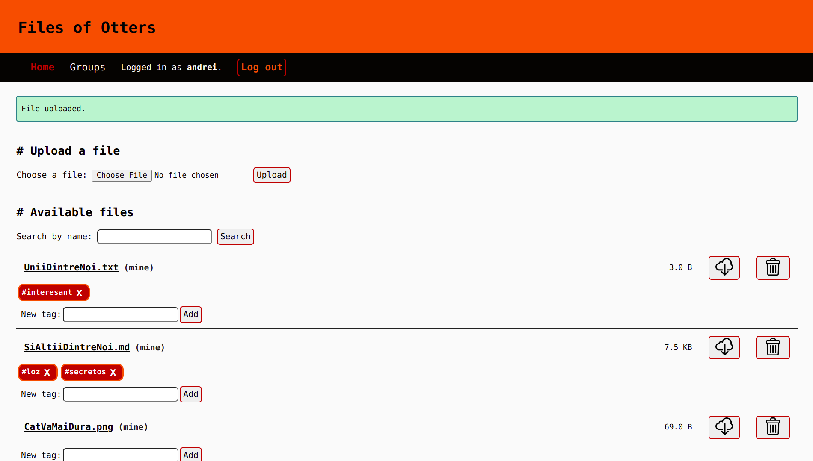

# Files of Otters

**Files of Otters** is a file-sharing system, a web app which allows you to
upload files and share them with otter [*sic*] users you trust.

## Main features

- File upload and download
- Privacy control
- File search
- File organization with tags

## Documentation

If you want to learn how to do something with the app, you can find some docs
[here](docs).

## Development

This app is being developed using git, and the central repo is on Github, at
[this address](https://github.com/alcoholic-otters/filesofotters).

## License

This project is licensed under the terms of the MIT license.
